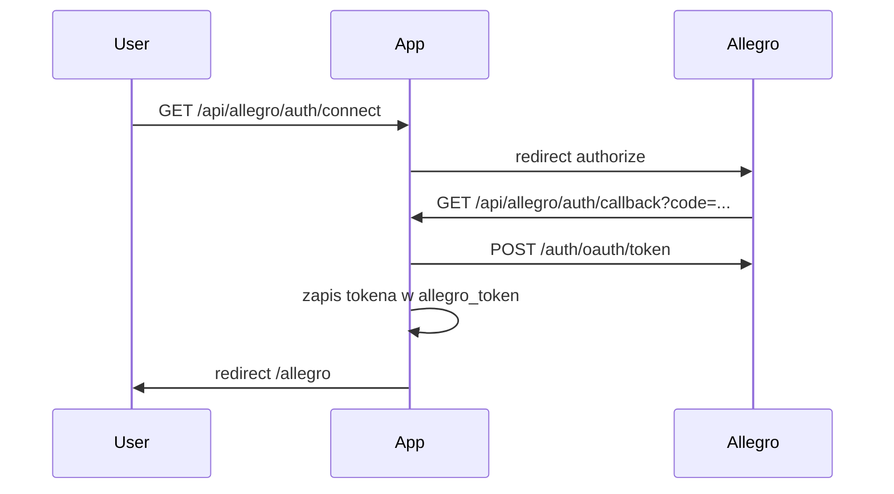

# Integracja Allegro Sandbox

## Cel

Połączenie z Allegro Sandbox (OAuth2) i wyświetlanie:
- aktywnych ofert sprzedawcy (`GET /sale/offers`)
- sprzedanych pozycji z zamówień (`GET /order/checkout-forms`)

Dostęp przez REST i stronę Vaadin `/allegro`.

## Konfiguracja

1. Zarejestruj aplikację na [Allegro Sandbox Developer](https://apps.developer.allegro.pl.allegrosandbox.pl/).
2. Ustaw **Redirect URI**: `http://localhost:8080/api/allegro/auth/callback`
3. Skopiuj **Client ID** i **Client Secret**.

```bash
set ALLEGRO_CLIENT_ID=twoj-client-id
set ALLEGRO_CLIENT_SECRET=twoj-client-secret
set ALLEGRO_REDIRECT_URI=http://localhost:8080/api/allegro/auth/callback
```

## OAuth



Scope: `allegro:api:sale:offers:read` + `allegro:api:orders:read`

## Endpointy aplikacji

| Endpoint | Opis |
|----------|------|
| `GET /api/allegro/auth/connect` | Start OAuth |
| `GET /api/allegro/auth/callback` | Callback OAuth |
| `GET /api/allegro/auth/status` | `{ connected: true/false }` |
| `GET /api/allegro/offers` | Lista ofert |
| `GET /api/allegro/sold-items?from=&to=` | Sprzedane pozycje |

## Warstwy

- Config: `AllegroApiProperties`, `AllegroAuthInterceptor`, `allegroRestClient`
- DB: tabela `allegro_token` (singleton)
- Client: [AllegroApiClient](../../src/main/java/pl/tw/ksiegowosc/client/AllegroApiClient.java)
- Services: `AllegroAuthService`, `AllegroOffersService`, `AllegroOrdersService`
- UI: [AllegroView](../../src/main/java/pl/tw/ksiegowosc/ui/AllegroView.java)

## Testy sandbox

Do testów zamówień potrzebne są 2 konta sandbox (sprzedawca + kupujący) oraz wygenerowanie testowego zakupu.
