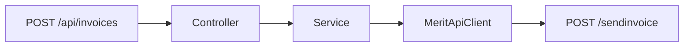

# Endpoint tworzenia faktury sprzedaży

## API Merit

Polski v1: `https://program.360ksiegowosc.pl/api/v1`

- Wywołanie: `POST /sendinvoice`
- Klient: istniejący rekord — w payloadzie tylko `Customer.Id`
- `AccountingDoc: 1` (faktura)
- Daty `DocDate` / `DueDate` w formacie `yyyyMMdd000000`
- Wymagane m.in. `InvoiceNo`, `InvoiceRow`, `TaxAmount`, `TotalAmount`
- W naszym API wymagane też `HComment` i `FComment` (komentarz górny i dolny)
- Sukces: `{ "CustomerId": "...", "InvoiceId": "..." }`

## Endpoint aplikacji

`POST /api/invoices`

- body JSON (camelCase), walidacja Bean Validation (`@Valid`)
- odpowiedź `201`: `{ "invoiceId", "customerId" }`
- błędy Merit → `ApiExceptionHandler` / `MeritErrorMessages`

## Warstwy

- DTO publiczne: `CreateInvoiceRequest` (+ linie i VAT) oraz `CreateInvoiceResponse`
- DTO Merit: `MeritCreateInvoiceRequest` i powiązane rekordy z `@JsonProperty` PascalCase
- [MeritApiClient](../../src/main/java/pl/tw/ksiegowosc/client/MeritApiClient.java): `createInvoice(...)`
- [InvoicesService](../../src/main/java/pl/tw/ksiegowosc/service/InvoicesService.java): mapowanie dat i pól, `AccountingDoc = 1`
- [InvoicesController](../../src/main/java/pl/tw/ksiegowosc/controller/InvoicesController.java): `@PostMapping` + `@ResponseStatus(CREATED)`
