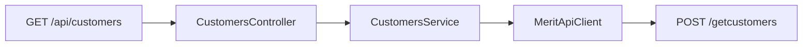

# Endpoint listy klientów

## API Merit

Polski v1: `https://program.360ksiegowosc.pl/api/v1`

- Wywołanie: `POST /getcustomers`
- Body: `{}` albo `{ "Name": "<fragment>" }` (broad match)
- Odpowiedź: tablica klientów albo pojedynczy obiekt

## Endpoint aplikacji

`GET /api/customers`

- opcjonalny query `name`
- zawsze zwraca listę (pojedynczy wynik Merit jest zawijany)
- błędy Merit → `ApiExceptionHandler`

## Warstwy

- DTO: `CustomerDto`, `MeritCustomersRequest`
- [MeritApiClient](../../src/main/java/pl/tw/ksiegowosc/client/MeritApiClient.java): `getCustomers(name)` + normalizacja JSON
- [CustomersService](../../src/main/java/pl/tw/ksiegowosc/service/CustomersService.java)
- [CustomersController](../../src/main/java/pl/tw/ksiegowosc/controller/CustomersController.java)
