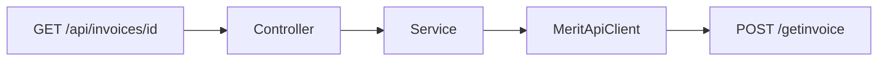

# Endpoint szczegółów faktury sprzedaży

Commit: `7bf897d`

## API Merit

Polski v1: `https://program.360ksiegowosc.pl/api/v1`

- Wywołanie: `POST /getinvoice`
- Body: `{ "Id": "<SIHId>", "AddAttachment": false }`
- Odpowiedź: `Header`, `Lines`, `Payments`, opcjonalnie `Allocations`

## Endpoint aplikacji

`GET /api/invoices/{id}`

- `id` = `SIHId` z listy faktur
- opcjonalny query `addAttachment` (domyślnie `false`)
- Swagger: `@Operation` / `@Parameter`
- brak faktury → `404`

## Model

DTO z `@JsonIgnoreProperties(ignoreUnknown = true)` i polami PascalCase: request (`Id`, `AddAttachment`), odpowiedź (`Header`, `Lines`, `Payments`, `Allocations`).

## Warstwy

- [MeritApiClient](src/main/java/pl/tw/ksiegowosc/client/MeritApiClient.java): `getInvoiceDetails(id, addAttachment)`
- [InvoicesService](src/main/java/pl/tw/ksiegowosc/service/InvoicesService.java): przekazanie + 404 przy braku faktury
- interceptor HMAC bez zmian
