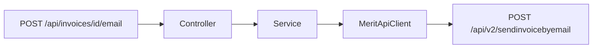

# Endpoint wysyłki faktury e-mailem

Commit: `9467a2b`

## API Merit

Dokumentacja wysyłki e-mail tylko na **v2**:

- `POST https://program.360ksiegowosc.pl/api/v2/sendinvoicebyemail`
- Body: `{ "Id": "<SIHId>", "DelivNote": false }`
- Sukces: tekst `OK` albo komunikat błędu
- Adres e-mail z kartoteki klienta w Merit — nie w payloadzie

Drugi `RestClient` v2 z tym samym interceptorem HMAC; v1 bez zmian.

## Endpoint aplikacji

`POST /api/invoices/{id}/email`

- `id` = `SIHId`
- opcjonalny query `delivNote` (domyślnie `false`)
- sukces: `{ "status": "OK" }`
- inna odpowiedź niż `OK` → `502` z treścią błędu

## Konfiguracja

- [application.yml](src/main/resources/application.yml): `v2-base-url`
- [HttpClientsConfig.java](src/main/java/pl/tw/ksiegowosc/config/HttpClientsConfig.java): bean `meritV2RestClient`
- [MeritApiClient](src/main/java/pl/tw/ksiegowosc/client/MeritApiClient.java): `sendInvoiceByEmail(id, delivNote)`
