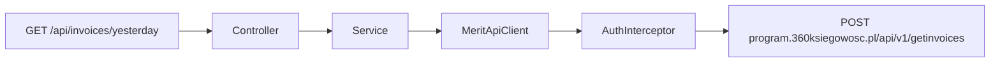

# Klient Merit: faktury sprzedaży

Commit: `ac62bfe`

## Zakres

Zastąpienie przykładowej integracji NBP klientem Merit Aktiva dla faktur sprzedaży z polskim endpointem.

## Integracja z API

- Base URL: `https://program.360ksiegowosc.pl/api/v1`
- Wywołanie: `POST /getinvoices`
- Body JSON (PascalCase): `PeriodStart`, `PeriodEnd` (`yyyyMMdd`), `DateType: 0` (data dokumentu)
- Uwierzytelnianie query string: `apiId`, `timestamp` (`yyyyMMddHHmmss` UTC), `signature` = Base64(HMAC-SHA256(`apiId + timestamp + body`, `apiKey`))

## Zmiany w kodzie

- Konfiguracja w [application.yml](src/main/resources/application.yml): `clients.merit.base-url`, `api-id`, `api-key`
- [MeritApiProperties](src/main/java/pl/tw/ksiegowosc/config/MeritApiProperties.java)
- Interceptor HMAC w [HttpClientsConfig.java](src/main/java/pl/tw/ksiegowosc/config/HttpClientsConfig.java)
- [MeritApiClient](src/main/java/pl/tw/ksiegowosc/client/MeritApiClient.java) — lista faktur
- DTO: `SIHId`, `InvoiceNo`, `DocumentDate`, `CustomerName`, `TotalAmount`, `Paid`

## Założenia

- Credentials przez zmienne `MERIT_API_ID` / `MERIT_API_KEY`
- API v1 `getinvoices`; bez paginacji i szczegółów pojedynczej faktury (dodane później)
