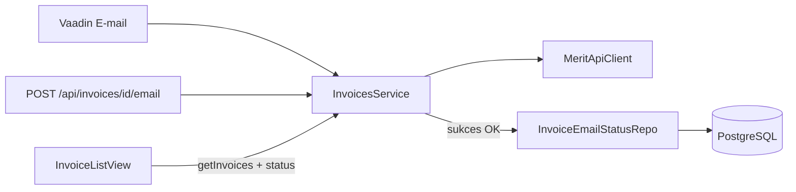

# Postgres + Liquibase: status wysyłki e-mail

## Zakres

Lokalna baza PostgreSQL przechowuje, czy faktura (po `SIHId` z Merit) miała wysłany e-mail z tej aplikacji oraz kiedy ostatnio wysłano. Dostęp przez Hibernate (Spring Data JPA). Migracje schematu przez Liquibase.

Po udanym [`InvoicesService.sendInvoiceByEmail`](src/main/java/pl/tw/ksiegowosc/service/InvoicesService.java) zapisujemy `email_sent = true` i `email_sent_at = now()` — ta sama ścieżka dla REST `POST /api/invoices/{id}/email` i przycisku „E-mail” w Vaadin.

Na liście faktur kolumny **„Wysłano”** (Tak/Nie) i **„Data wysyłki”**.

## Schemat bazy

Tabela `invoice_email_status` (Liquibase: `001-invoice-email-status.yaml`):

| Kolumna | Typ | Opis |
|---|---|---|
| `invoice_id` | `VARCHAR(64)` PK | `SIHId` z Merit |
| `email_sent` | `BOOLEAN NOT NULL DEFAULT false` | czy wysłano e-mail |
| `email_sent_at` | `TIMESTAMPTZ` | kiedy ostatnio wysłano (null gdy nigdy) |

Hibernate: `ddl-auto: validate` — schemat wyłącznie z Liquibase.

## Warstwa JPA

- Entity `InvoiceEmailStatus` (`invoiceId`, `emailSent`, `emailSentAt`)
- `InvoiceEmailStatusRepository` — `findAllByInvoiceIdIn(...)`
- [`InvoicesService`](src/main/java/pl/tw/ksiegowosc/service/InvoicesService.java):
  - po sukcesie `sendInvoiceByEmail`: upsert `emailSent = true`, `emailSentAt = Instant.now()`
  - `getInvoices`: lista z Merit + dołączenie statusów z bazy
- [`SalesInvoiceDto`](src/main/java/pl/tw/ksiegowosc/dto/SalesInvoiceDto.java): pola `emailSent`, `emailSentAt` (ustawiane w serwisie, nie z JSON Merit)

## Konfiguracja

**Produkcja:** Render Managed Postgres — zmienne `SPRING_DATASOURCE_URL`, `SPRING_DATASOURCE_USERNAME`, `SPRING_DATASOURCE_PASSWORD`.

**Lokalnie:** [`docker-compose.yml`](docker-compose.yml) (Postgres 16, port 5432, baza/użytkownik/hasło: `ksiegowosc`).

**Testy:** H2 in-memory + Liquibase w `src/test/resources/application.yml`.

## UI

[`InvoiceListView`](src/main/java/pl/tw/ksiegowosc/ui/InvoiceListView.java):

- kolumny „Wysłano” i „Data wysyłki” przed „Akcje”
- po udanej wysyłce odświeżenie listy

## Poza zakresem

- historia wielokrotnych wysyłek (tylko ostatni timestamp)
- migracja historycznych wysyłek z Merit
- Testcontainers
