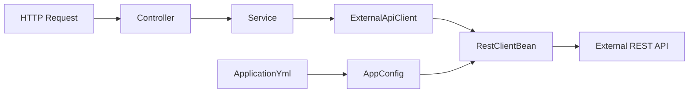

# Szkielet Spring Boot z RestClient

Commit: `ac62bfe`

## Zakres

Projekt Spring Boot 4.1.x z Java 25 i Mavenem w katalogu repozytorium.

## Co powstało

- [pom.xml](pom.xml) z parentem Spring Boot 4.1.x oraz zależnościami dla walidacji, testów i `RestClient`
- Główna klasa startowa i podział pakietów: `config`, `client`, `service`, `controller`, `dto`
- Konfiguracja klienta REST z beanem `RestClient` i `base-url` w [application.yml](src/main/resources/application.yml)
- Przykładowy klient integracyjny wywołujący zewnętrzne API
- Prosty endpoint: `controller -> service -> REST client`
- Minimalne testy startowe w `src/test/java`

## Architektura

## Założenia

- Spring Boot 4.1.x z Java 25
- Natywny Spring `RestClient`, bez Feign i WebClient
- Szkielet gotowy do dalszego rozwijania
