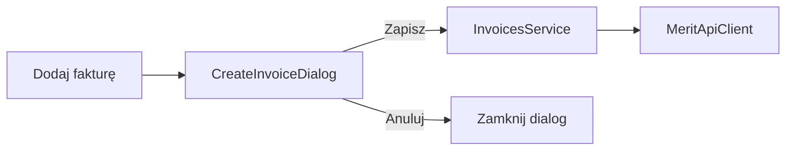

# Formularz dodawania faktury w Vaadin

## Zakres

Przycisk **„Dodaj fakturę”** na [InvoiceListView](../../src/main/java/pl/tw/ksiegowosc/ui/InvoiceListView.java) otwiera dialog z polami wymaganymi przez `InvoicesService.createInvoice` (to samo co `POST /api/invoices`). Bez zmian REST ani konfiguracji Merit.

## UI

- Przycisk po lewej od nagłówka „Faktury”
- [CreateInvoiceDialog](../../src/main/java/pl/tw/ksiegowosc/ui/CreateInvoiceDialog.java): formularz + **Zapisz** / **Anuluj**
- Jedno pole `taxId` (GUID stawki VAT) kopiowane do pozycji i `taxAmounts`
- Sukces / błąd: `Notification` `TOP_END` (jak przy e-mailu); po sukcesie odświeżenie listy

## Poza zakresem

- dynamiczne wiele pozycji
- TestBench
