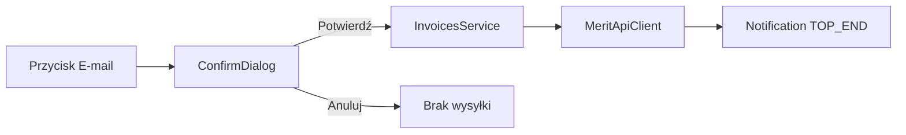

# Przycisk wysyłki e-mail w wierszu listy

## Zakres

Kolumna akcji w [InvoiceListView](src/main/java/pl/tw/ksiegowosc/ui/InvoiceListView.java) z przyciskiem „E-mail” w każdym wierszu. Po potwierdzeniu w dialogu wywołanie `InvoicesService.sendInvoiceByEmail(sihId, false)`. Adres e-mail z kartoteki klienta w Merit (jak REST `POST /api/invoices/{id}/email`).

Bez opcji WZ (`delivNote`) i bez nowego endpointu REST.

## UI

- przycisk „E-mail” (`LUMO_SMALL`, `LUMO_TERTIARY`); nieaktywny bez `sihId`
- `ConfirmDialog`: „Wyślij fakturę e-mailem?”, treść: numer + klient
- przycisk wyłączony na czas wywołania API
- `Notification` w prawym górnym rogu (`TOP_END`), 5 s:
  - sukces (`LUMO_SUCCESS`): „Wysłano fakturę {numer}.”
  - błąd (`LUMO_ERROR`): komunikat Merit lub ogólny błąd
- błędy listy faktur też na `TOP_END` (wspólny wzorzec)

## Poza zakresem

- checkbox WZ / `delivNote`
- nowy endpoint REST
- testy TestBench widoku
