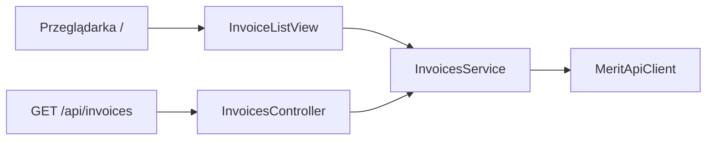

# Ekran listy faktur w Vaadin

Commit: `9910bda`

## Zakres

Ekran Vaadin Flow na `/` z listą faktur sprzedaży. REST `/api/**` i Swagger bez zmian. UI woła bezpośrednio [InvoicesService](src/main/java/pl/tw/ksiegowosc/service/InvoicesService.java).



## Zależności

- Vaadin BOM **25.2.6**, `vaadin-spring-boot-starter`, `vaadin-dev` (optional)
- Profil Maven `production` z `vaadin-maven-plugin` (`prepare-frontend`, `build-frontend`)
- Dockerfile: `mvn -B -DskipTests -Pproduction package`

## Ekran

[InvoiceListView](src/main/java/pl/tw/ksiegowosc/ui/InvoiceListView.java):

- `@Route("")`, DatePicker od/do (domyślnie 30 dni), Grid z kolumnami faktury
- błędy jako `Notification`
- `AppShellConfigurator` z tytułem „Ksiegowosc”

## Konfiguracja

```yaml
vaadin:
  exclude-urls: /api/**,/swagger-ui/**,/v3/api-docs/**
  launch-browser: false
```

## Poza zakresem (w momencie wdrożenia)

- szczegóły faktury w UI
- wysyłka e-mail z UI (dodana później)
